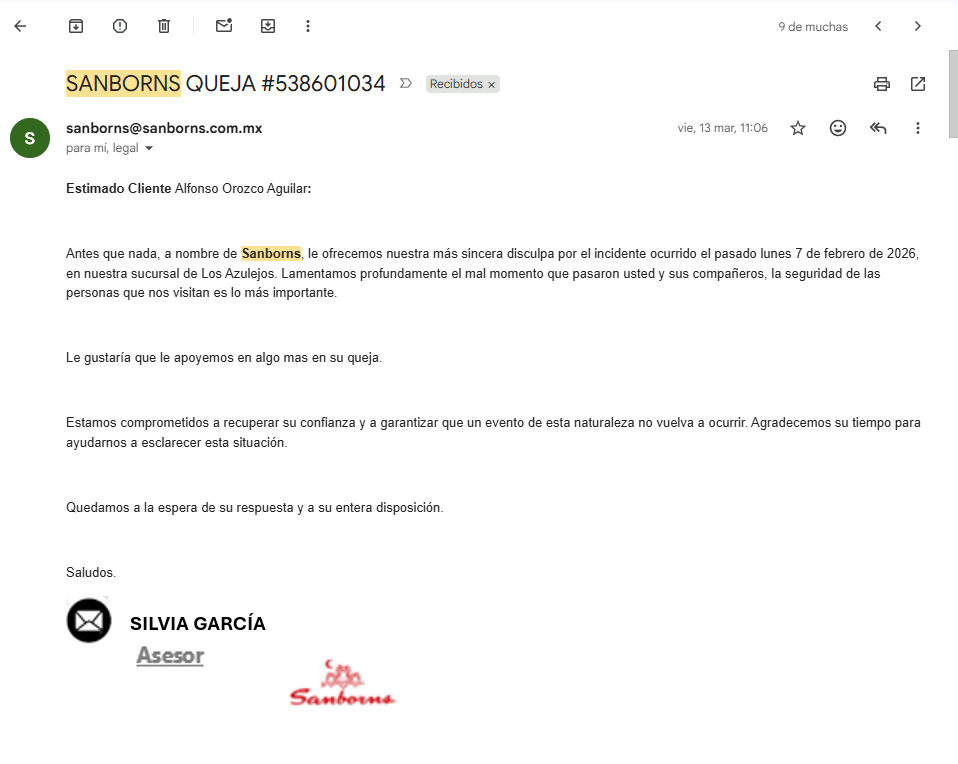
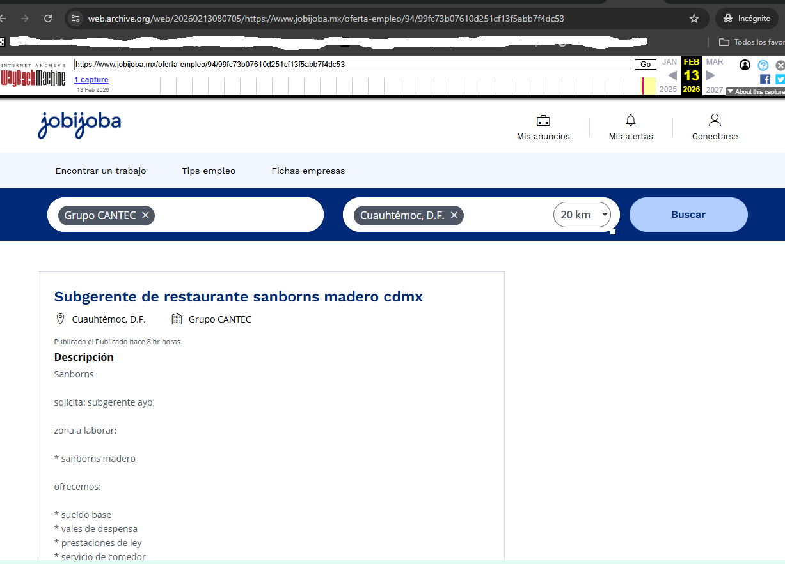
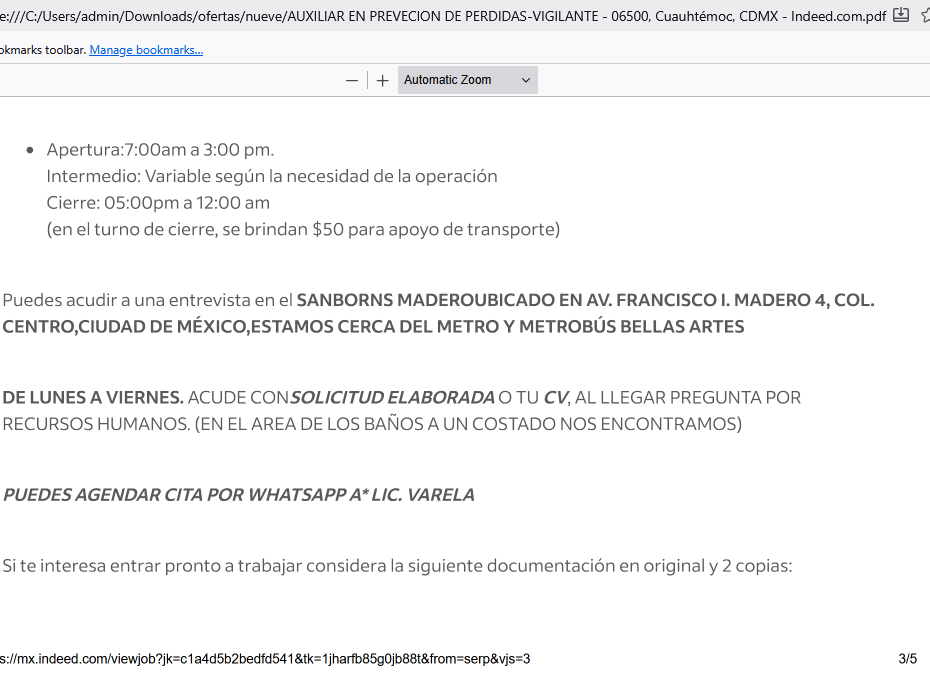

# Framework de Análisis Estadístico y Legal 
## Caso: Código 5 / Mystery Shopper / Riesgo Operativo

**Autor:** Alfonso Orozco Aguilar  
**Repositorio:** Incluye Documentación técnica complementaria a denuncias formales  
**Última actualización:** Abril 2026

## Justificación Metodológica: Respuesta del Auditor (NIA 330)

El desarrollo de este framework y la documentación del "Caso Código 5" no representan una respuesta reactiva, sino una ejecución deliberada de la **Norma Internacional de Auditoría 330 (NIA 330)**, la cual dicta las respuestas del auditor a los riesgos valorados.

### 1. Validación de Control en Tiempo Real (Walkthrough)
Ante la detección de un colapso de gobernanza el 7 de febrero de 2026, se procedió a neutralizar la asimetría de información mediante una **interpelación técnica dirigida (pregunta trampa de auditoría)** al Gerente de Sucursal. Este procedimiento tuvo como objetivo único validar la presencia —o ausencia— de supervisión jerárquica efectiva, confirmando la inexistencia de controles operativos en el momento del incidente.

### 2. Cumplimiento del Deber Legal (Art. 222 CNPP)
En estricto cumplimiento del **Artículo 222 del Código Nacional de Procedimientos Penales (México)**, se procedió a la notificación formal ante la Secretaría de Seguridad Ciudadana (SSC). El framework actúa aquí como el repositorio de la **cadena de custodia informativa**, organizando los hechos en una línea de tiempo verificable (Pasado, Presente y Futuro) para su uso por las autoridades competentes.

### 3. Eliminación de Sesgos mediante Peritaje Forense
Para garantizar la objetividad de la NIA 330, se implementaron mecanismos de validación técnica que superan el testimonio humano:
* **Análisis Bayesiano:** Para verificar la probabilidad de la narrativa institucional frente a la evidencia física.
* **Peritaje de Sentimientos (Tensores/IA):** Aplicado para evaluar la neutralidad del auditor durante la crisis y confirmar que la respuesta fue profesional y no emocional.
* **Consenso Jurídico de IA (RAG):** Para validar la interpretación de contratos y normativas vigentes.

### 4. Conclusión Técnica
Todo el proceso documentado en este framework es la **respuesta técnica a una situación de crisis de control interno**. La herramienta centraliza cerca de 80 puntos de control para facilitar la exportación de datos hacia una **Cédula de Observaciones y Hallazgos de Auditoría (COHA)**, garantizando que la evidencia sea replicable, segura y auditable bajo estándares internacionales.

---

## Contexto

Este repositorio constiene herramientas de Código libre GPL para documentar NIAs y puntos específicos de control de un reporte master de auditoría COHA. El framework permite la organización en un solo documento resultado, de fragmentos que nor malmente viven en su propio word.

- 1 - Cédula de Observaciones y Hallazgos de Auditoría (COHA)
- 2 - Informe de Deficiencias Significativas de Control Interno (bajo NIA 265): Es el término técnico exacto cuando un auditor comunica a la administración (en este caso, a Grupo Carso) que sus controles no funcionan.
- 3 - Cédula Sumaria de Papeles de Trabajo: Si el PHP consolida los 80-x puntos de control, actúa como una "Sumaria" que agrupa las evidencias individuales (los audios, videos y fotos) en un solo cuerpo legal.
- 4 - Dictamen de Auditoría de Cumplimiento: Como estás revisando si cumplen con la NOM-251, la Ley de Seguridad Privada y la Ley de Protección al Consumidor, el resultado es un "Dictamen de Cumplimiento".

## Caso de Uso

El auditor Social, en este caso Alfonso Orozco Aguilar, cliente de 34 años de antiguedad en Sanborns de los azulejos de madero 4 cdmx, le tocó vivir el 7 de febrero 2026 a las 16:20 horas un incidente de completa falta de gobernanza y control de Grupo Carso. El incidente tenía también puntosque por articulo 222 de Código nacional de Procedimientos Penales (Mexico) era necesario reportar a las autoridades y organizar infomración en ejs de presente pasado y futuro, mas aspectos auditoria, NIA violadas, problemas de anélisis bayesiano, consenso Jurídico de IA sobre contratos y anáslis sde sentimientos con tensores , Rag y similares, hizo necesario generar este framework.

En medio de la documentación se hicieron vistas cruzadas de Mistery Shopper que mostraron anomalías de higiene y areas de oportunidad tanto de marketing como de capacitación para escuelas, por lo cual se hizo un desglose en 250 slides de powerpoint, mas análisis de caldiad de comida y oportunidades kash.

## Consideraciones.

En COHA: El sistema software que yo hice y no publico aquí genera la Trazabilidad de la Evidencia, ligando el hallazgo directamente al Hash SHA-256 de los audios/videos. Eso cierra la puerta a alegatos de manipulación. En este caso no pongo el módulo porque se prestaría a 1 ) regalar mi trabajo b ) tener que subir la documentación de audios y videos que serían violatorios de datos personales. En https://alfonsoorozco.com/codigo5/ Está parte de la salida de hashes entregadas a Secretaría de Seguridad Ciudadana.

**Nota:** Se busca ser auxiliar en Metodología de Auditoría 4.0: Convergencia de modelos probabilísticos y modelos de lenguaje de gran escala (LLMs) para la eliminación de sesgos en el peritaje.

Sobre el Mystery Shopper: Creando áreas del software similar a FAQs puede permitirse la Auditoría de Seguimiento (Follow-up), lo que prueba la "reincidencia" o "falta de remediación" (un concepto clave en NIAs). Solo que esto lo uso en trabajos de seguminento en práctica privada, por lo cual no voy a poner el dato aquí.

## El objetivo del framework codigo5

El objetivo es la Consolidación Forense de Pruebas para garantizar la integridad de la cadena de custodia informativa, in depnder de localización en word o Excel.

Se busca con el software principal preparar un concentrado de localización de información.

Se adjuntan algunos scripts de análisis bayesiano y similares.

---

Este repositorio contiene el análisis estadístico, forense y de riesgo derivado de dos visitas documentadas a Sanborns Los Azulejos (Av. Francisco I. Madero No. 4, Centro Histórico, CDMX):

| Visita | Fecha | Tipo | Resultado |
|--------|-------|------|-----------|
| 1 | 7 febrero 2026 | Cliente regular | Código 5 / Hostigamiento / Sin servicio 2 horas |
| 2 | 7 marzo 2026 | Mystery Shopper incógnito | Comida fría / Violación NOM-251 / Contaminación cruzada |

---
# Framework "Código 5": Auditoría Social Procedural
**Versión:** 1.0.0-beta | **Licencia:** GPL v3.0  
**Stack:** PHP 8.x (Procedural) | MariaDB | Single-File Architecture

## 🛠 Propósito Técnica
Esta herramienta ha sido desarrollada para centralizar y gestionar cerca de **80 puntos de control** derivados de incidentes de cumplimiento corporativo. El sistema transforma observaciones empíricas en **Papeles de Trabajo** estructurados bajo las **Normas Internacionales de Auditoría (NIA)**.

## 🏗 Arquitectura de Soberanía Digital
Para garantizar la seguridad, replicabilidad y portabilidad, el framework sigue estos principios:
* **Soberanía del Código:** Desarrollo en **PHP 8.x Procedural** para facilitar la lectura y auditoría del código fuente.
* **Sistema de Archivo Único:** Toda la lógica de negocio reside en un solo archivo, eliminando la complejidad de despliegue.
* **Portabilidad MariaDB:** Gestión de datos optimizada para motores SQL estándar, facilitando la exportación e importación de evidencias.
* **Dependencias Transparentes:** Uso de **jsDelivr** para recursos de interfaz, garantizando tiempos de carga óptimos sin sacrificar la independencia del servidor.

## 🛡 Mecanismos de Seguridad y Control
* **Filtro de Acceso:** Implementación de control por **Dirección IP** para restringir la manipulación de los datos de auditoría.
* **Integridad de Datos:** Diseñado para almacenar el **Reporte Master de Auditoría**, facilitando la localización inmediata de hallazgos para su exportación a formatos documentales (Word/PDF) o peritajes legales.
* **Enfoque NIA:** Estructura de base de datos diseñada para cumplir con NIA 230 (Documentación) y NIA 265 (Comunicación de Deficiencias).

## 🚀 Replicabilidad
El lenguaje y stack se eligen deliberadamente por su ubicuidad. Cualquier auditor social puede desplegar esta herramienta en entornos locales o servidores estándar en cuestión de minutos.

---

## Denuncias activas

- **PROFECO** Folio 0002822-2026 — Estado: **PROCEDENTE**
- **CONAPRED** — En investigación
- **SSC CDMX** — Denuncia 16 febrero 2026, derivó visita de inspección DGSPyCI/VS/021/2026 notificado en Oficio SSC-SDI-DGSPyCI-DSP-SSyS-238-2026; en espera de datos para la querella penal. Solo han actuado por vía administrativa de esfera pública.
- **Grupo Carso** — Notificación sin acuse de recibo 10 febrero 2026
- **Sanborns** — Responde a la queja 538601034 el 13 de marzo de 2026 a través de Silvia García (Asesor), es lo que en auditoría llamamos una respuesta paliativa sin fondo:

---

## Módulos de Auditoría (PHP Soberano)

| Archivo | Descripción Técnica y Normativa |
|:--- |:--- |
| `index.php` | **Panel de Control:** Punto de entrada centralizado que orquesta la visualización de hallazgos y el estado de las denuncias legales. |
| `bayesiano_marzo.php` | **Análisis de Probabilidad Condicional:** Implementación del Teorema de Bayes para determinar la probabilidad de fallo sistémico en la visita de marzo, basado en 24 anomalías conductuales. |
| `arbol_decisiones.php` | **Matriz de Riesgo del Cliente:** Algoritmo que evalúa las rutas de escalación ante el hostigamiento, alineado con la valoración de riesgos de la **NIA 315**. |
| `riesgo_patrimonial.php` | **Modelo de Impacto Económico:** Cuantificación del riesgo derivado de la elusión de controles internos (**NIA 240**) y el impacto de incidentes en el entorno de control (COSO). |
| `cifra_negra.php` | **Inferencia de Incidentes No Reportados:** Módulo estadístico para estimar la brecha entre quejas oficiales e incidentes reales no denunciados por otros usuarios (**NIA 265**). |
| `comparativa.php` | **Benchmark de Incumplimiento:** Análisis comparativo de métricas entre ambas visitas, estableciendo el umbral de importancia relativa (**NIA 320**). |

---

## Metodología

- **NIA 230** Documentación de auditoría con evidencia contemporánea.
- **NIA 240** Identificación de elusión de controles por dirección.
- **NIA 265** Deficiencias significativas en control interno.
- **NIA 315** Valoración de riesgos de incorrección material.
- **NIA 320** Importancia relativa — umbral cero en discriminación.
- **Marco COSO** Evaluación de entorno de control.
- **Análisis Bayesiano** Probabilidad condicional sobre anomalías detectadas.
- **NOM-251-SSA1-2009** Violaciones a normas de higiene documentadas.

---

## Reproducibilidad y Soberanía Tecnológica

- **Lenguaje:** PHP 8.x Procedural (Sovereign Code).
- **Dependencias:** Cero. Sin librerías externas ni frameworks (Anti-NPM).
- **Ejecución:** Compatible con cualquier entorno LAMP/LEMP estándar. Los cálculos son auditables línea por línea para peritajes técnicos.
---
### 📂 Hallazgo 02-B: Peritaje de Riesgo Táctico y Amenaza de Escalada de Violencia

**Papel de Trabajo: PT-002-B | Análisis de Supervivencia y Capacidad de Respuesta (SSC-CDMX)**

#### 1. Perfil del Auditor: El "Observador Avanzado"
Este análisis no emana de un cliente convencional, sino de un profesional con **34 años de experiencia técnica** y **20 años en el sector retail de alta gama**, con entrenamiento especializado en **defensa personal**, auditoría y contabilidad , además de 33 años de experiencia en desarrollo de sistemas y evaluación de personal y análisis de puestos para gobierno federal bajo NDA. Esta formación permitió una lectura de la escena que el personal de Sanborns, debido a su precaria capacitación, no pudo prever ni gestionar.

* **Detección de Amenaza Inmediata:** Ante la ausencia de gafetes identificadores y la actitud de "fijación de manos" por parte de sujetos no uniformados, el diagnóstico táctico inicial fue de **intento de asalto o secuestro** por civiles infiltrados.
* **Configuración de Agresión en Pandilla:** La movilización coordinada de más de tres sujetos sin identificación hacia una área donde se encontraba una mujer constituye, bajo análisis de riesgo, una preparación para **asociación delictuosa e intento de lesiones**, y mas con fijación en manos amparada por videos de la afectada, interrumpidos por personal de meseras.

#### 2. La Falla Táctica Crítica: El Flanco Derecho Descubierto
Mientras el personal de Sanborns (presumiblemente ex-policías con vicios de entrenamiento de "fuerza de choque") concentraba toda su capacidad de coacción en hostigar al acompañante femenino del auditor, cometieron un error de seguridad elemental que puso en riesgo a terceros:

* **Abandono de Perímetro:** Por enfocarse en un hostigamiento ilegal derivado de una falsa alarma ("Código 5"), los elementos de seguridad **abandonaron la vigilancia del flanco derecho del primer piso de la sucursal**.
* **Vulnerabilidad Masiva de Civiles:** Se estima que entre **40 y 50 comensales** quedaron en situación de desprotección total ante cualquier amenaza real externa. La "seguridad" de la casa estaba ocupada intimidando a una mujer y a un cliente histórico mientras ignoraba la integridad del resto del establecimiento. Su intento de "bloquear" mis movimientos me daba paso libre a la derecha que a su vez tenía dos salidas. Era imposible una contención real con ese descuido que ponía en riesgo a por lo menos 40-50 clientes sentados junto al área donde asignan mes, cercana al elevador. Literalmente error básico.
* **Decisión Táctica de No Intervención:** Debido a que no hubo contacto físico, por técnicas de desescalamiento aplicadas por el aduitor y no por el personal de Sanborns, El auditor tomó la decisión consciente de **no neutralizar a los tres agresores inmediatos** —pese a contar con la capacidad física y técnica para hacerlo, además de derecho legal a legítima defensa— con el único fin de evitar un escenario de **sangre, lesiones graves y pánico masivo**, priorizando la seguridad de los civiles que Sanborns dejó desprotegidos por su incompetencia.
* **Esto se encuentra amparado por grabaciones de video y audio de dos personas, siendo cuatro los afectados, incluyendo al auditor** 

#### 3. Implicaciones Penales y Constitucionales
La negligencia de Sanborns al emplear personal mal entrenado, no identificado y propenso a la provocación creó un escenario donde cualquier respuesta defensiva habría sido legalmente **Legítima Defensa**, pero operativamente una tragedia evitable:

* El código cinco no era procedente. El auditor salió y compró en planta baja pan dulce con factura nominativa, y después consumió en otra sucursal del mismo grupo a tres cuadras.
* Llamar alas autordades  o fuerza pública no era procedente.
* El uso de civiles , cerco físico no era necesario y era violatorio entre otras cosas al artículo 10 de la ley del consumidor, de la cual **el personal de mando era GARANTE** además de las otros leyes respectivas del código civil y penal, entre otros.
* **Tentativa de Lesiones/Homicidio:** Provocada por la intimidación física y visual hacia los ocupantes de la mesa.
* **Violación al Art. 16 Constitucional:** Actos de molestia sin mandamiento escrito ejecutados por personal cuya relación laboral es incierta (Caso CANTEC).
* **Simulación de Autoridad:** Uso de protocolos de seguridad privada sin certificaciones visibles, escalando un conflicto administrativo a un nivel de riesgo de vida.
* **Otros** Riña con premeditiación alevosía y ventaja (uno contra muchos), asociación delcituosa, etc.
* **Reales** hay otras responsabilidads por activar código cinco en un cliente que solo pidió hablar con gerente después que no lo atendieron dos hora,s que ya no son tentativa sino mal uso de los servicios de Emergencia, detallado en papelEs de trabajo por 211 quater de Codigo Penal de CDMX y cultura civica de CDMX.

> **Nota sobre Responsabilidad Jurídica:** La responsabilidad directa y solidaria recae plenamente en la razón social **Sanborns Hermanos** y sus subcontratistas. Esta obligación es vinculante independientemente de la razón social, puesto o jerarquía de los agresores, sean estos empleados directos de Grupo Carso o personal externo. En su calidad de **GARANTE**, el grupo empresarial tiene el deber ineludible de salvaguardar la integridad de sus clientes; la ignorancia de la normativa vigente o la delegación de funciones en terceros (como CANTEC) no los exime del cumplimiento de la ley ni de las consecuencias penales y civiles derivadas de la falta de control en sus instalaciones.
* La responsabilidad directa y solidaria era del personal de la razón social Sanborns Hermanos y sus subcontratas, sin importar la razón social, puesto, mando de los agresores fueran o no empleados de grupo Carso. Carso tenía el deber de GARANTE y la ignorancia de la ley no exime de cumplirla.
---

> **Veredicto del Auditor:** La sucursal Madero 4 no solo violó derechos del consumidor; generó un **escenario de riesgo de integridad física grave** por pura incompetencia operativa. La decisión del suscrito de ejercer contención física fue lo único que evitó un evento de nota roja provocado por la propia gerencia del establecimiento. El acercamiento en curso de un personal hacia la mujer del grupo, pudo haber tenid oreacciones de legítima defensa, ya que ni ella ni el auditor eran un peligro, pero el entrenamiento deficiente no les hizo darse cuenta de los riesgos físicos, penales e implicaciones de la prima de riesgo, y eso sin ser relación exhaustiva.
---
# 📂 Sección 03: Hallazgo Crítico - Análisis de Siniestralidad y Colusión (6 Meses Retroactivos)

**Papel de Trabajo: PT-002 | Auditoría de Riesgo Operativo y Responsabilidad Solidaria**

#### 1. Proyección Estadística de Cifra Negra (Factor x26)
Desde una perspectiva de auditoría contable, los incidentes detectados mediante **OSINT** en plataformas públicas son solo el indicador visible de un descontrol sistémico.
* **Cifra Negra Estimada:** En México, se estima que por cada delito denunciado o visibilizado, existen aproximadamente **26 casos que permanecen en la cifra negra** (no reportados o silenciados).
* **Incidencia en Primer Piso:** Se documentaron 4 casos críticos de robo en la zona del incidente y bar en un periodo de solo 4 meses.
* **Cálculo de Siniestralidad:** Aplicando el factor de proyección, la sucursal Madero 4 habría promediado más de **100 eventos delictivos** en el semestre previo, evidenciando una **nula** capacidad de control preventivo por parte de la gerencia.

#### 2. Vacío en Estructura de Mando e Indicios de Colusión
La auditoría de los testimonios de las víctimas sugiere que la falta de protocolos no es accidental, sino funcional a una red de despojo patrimonial.
* **Orquestación de Distracción:** Testigos describen que el personal (meseras y gerencia) aplicó maniobras de distracción y presión para el pago de la cuenta mientras las tarjetas robadas eran utilizadas en comercios externos (Oxxo/7-Eleven).
* **Falla del Principio A1:** La rotación constante y el uso de razones sociales externas como **Grupo CANTEC** para mandos medios genera un vacío de autoridad que facilita la colusión del personal de base.
* **Vínculo con Precarización:** La contratación de personal con secundaria y "sin experiencia" para seguridad interna garantiza una fuerza operativa incapaz de realizar un cerco táctico de 360°, permitiendo que el delito ocurra en presencia de los propios empleados.

#### 3. Responsabilidad Solidaria de Grupo Sanborns / Carso
Contablemente, la fragmentación de la nómina no exime a la entidad principal de sus obligaciones legales.
* **Unidad Económica:** Al ser la Casa de los Azulejos un activo de **Grupo Carso**, la empresa es **Responsable Solidaria** por los daños y perjuicios sufridos por los clientes dentro de sus instalaciones.
* **Negligencia en el Deber de Cuidado:** Mantener un esquema de seguridad basado en pagos informales de **$50 para transporte** y perfiles de "fuerza de choque" constituye una omisión administrativa grave que ha sido debidamente documentada en este repositorio.

---

#### 📂 Repositorio de Evidencia Técnica (Carpeta `robos/`)
Para facilitar la indexación y consulta de autoridades (STPS, IMSS, PROFECO), los archivos se encuentran organizados en el siguiente paquete:

* **Expediente PARCIAL Consolidado:** [`expediente_robos_6meses.zip`]
(https://github.com/AlfonsoOrozcoAguilarnoNDA/codigo5/raw/main/expediente_robos_6meses.zip)

* Se repite que son los incidentes notados en menos de seis meses de búsqueda NO EXHAUSTIVA y superficial realizado el 13 de feb 2026.

* **Contenido Indexado:**
    * `/robos/robo0.png` a `robo4.png`: Capturas de incidentes patrimoniales.
    * `worldtraveler.pdf`: Testimonio detallado de fraude y distracción operativa.
    * `50pesossdi.png`: Prueba de precarización laboral y riesgo de seguridad social.

> **Advertencia al Consumidor:** Este registro OSINT confirma que **Sanborns Madero 4** opera bajo un esquema de simulación de seguridad, donde los caminos de colusión o negligencia son igualmente perjudiciales para el consumidor. La recurrencia de robos y la colusión sugerida por las víctimas hacen de este establecimiento un punto de alto riesgo patrimonial.
---
### 🚩 Hallazgo 04: Irregularidad en Subcontratación y Cumplimiento (CANTEC)

* **Observación:** Se detectó la presencia y operación de personal uniformado y/o identificado bajo la razón social **"CANTEC"** realizando funciones de seguridad y control operativo dentro de la sucursal. Hay una vacante correspondiente a Subgerente de restaurante y otros puestos, pero cantec es otra empresa de giro diferente.
* **Incumplimiento Normativo:** Posible violación a la **Ley Federal del Trabajo (Art. 12, 13 y 14)**. La normativa vigente prohíbe la subcontratación de personal para realizar actividades que formen parte del objeto social y de la actividad económica preponderante del contratante (Sanborns), salvo servicios especializados que no sean del giro principal y que cuenten con registro **REPSE**.
* **Riesgo Fiscal y Patrimonial:** El uso de empresas de ramos ajenos al servicio prestado para el suministro de personal sugiere una **simulación laboral**. Esto conlleva la invalidez de la deducibilidad de dichos gastos para el contratante y genera una **responsabilidad solidaria** ineludible ante el IMSS y el SAT.

* **CANTEC:** "La utilización de reclutamiento de personal de una razón social ajena al giro (CANTEC) no solo constituye una falta administrativa, sino que activa la Responsabilidad Solidaria del beneficiario del servicio (Sanborns) ante cualquier daño civil o penal causado por dicho personal (Art. 15 LFT)."
---

### 🔍 Hallazgo 05: Análisis OSINT - Invalidez de Póliza y Estructura de "Choque"

Fuente documental externa :
https://web.archive.org/web/20260213080705/https://www.jobijoba.mx/oferta-empleo/94/99fc73b07610d251cf13f5abb7f4dc53

**Papel de Trabajo: PT-005 | Auditoría de Cumplimiento y Riesgo Táctico**

#### 0. Evidencia Visual de Simulación (Grupo CANTEC)
La siguiente evidencia documental confirma que la sucursal Madero 4 utiliza una estructura de "nómina espejo". Se emplea la marca **Sanborns** para el reclutamiento de mandos críticos, pero la responsabilidad legal se desplaza a **Grupo CANTEC**.

*Figura 1: Captura de vacante para Subgerente. Nótese la dualidad de marcas y la delegación de funciones de mando a una razón social externa.*
#### 1. Invalidez de la Cadena de Mando (Riesgo Penal)
La documentación técnica extraída mediante inteligencia de fuentes abiertas confirma que la sucursal operaba con una línea de mando fragmentada y delegada en terceros, lo que genera una desconexión legal grave.

* **Delegación Irregular de Mando:** El uso de la razón social **Grupo CANTEC** para contratar subgerentes con facultades de "coordinación de equipo" y "planeación de horarios" evidencia una transferencia de funciones esenciales del objeto social de Sanborns a un tercero.
* **Usurpación de Funciones:** Si un empleado de una empresa externa (CANTEC) ejecutó o instruyó el hostigamiento del "Código 5", se configura una extralimitación de facultades. Dado que el mando previo parece haber sido removido días antes (vacante de Jefe de Piso publicada el 12 de febrero), el incidente ocurrió en un vacío de control legal y operativo.
* **Conflicto en Seguros (Caso Inbursa):** Normalmente, un incidente de este tipo se reportaría a la AMIS y a la aseguradora. Sin embargo, al ser **Inbursa** la probable aseguradora, existe un conflicto de interés que permite omitir avisos de riesgo. Si el personal (ej. Emiliano Pérez Pérez) realizaba cobros o tareas de seguridad sin el perfil de puesto o la nómina correcta, la póliza queda **técnicamente nula** ante cualquier reclamo de responsabilidad civil.

#### 2. Deficiencias Tácticas: El Cerco de 360° Inexistente
El análisis de la falta de protocolos de seguridad se explica por una formación deficiente, posiblemente ligada a elementos que operan bajo lógicas de fuerzas públicas en retiro (ex-policías), inconsistentes con los estándares de seguridad privada corporativa.

* **Fallas de Vigilancia:** Se detectaron errores críticos de visión. El personal se enfoca en "hostigamiento", manejo visual a las manos" y seguimiento directo, perdiendo el **cerco de seguridad de 360 grados**. Esta negligencia táctica explica por qué el piso superior mantiene registros de robos a clientes a pesar de la agresiva vigilancia sobre comensales legítimos.
* **Perfil de "Fuerza de Choque":** La contratación de personal "Sin Experiencia" o "Practicantes" para seguridad interna sugiere que no son vigilantes certificados, sino elementos de choque entrenados para la intimidación, careciendo de criterio legal para gestionar conflictos.

#### 3. Elusión de Cargas Sociales (SDI Falso)
Se documenta una ingeniería de costos orientada a la elusión de responsabilidades fiscales y de seguridad social:

* **Ingresos no Declarados:** El ofrecimiento de **$50 en efectivo** para transporte (turno de cierre) y otros posibles ingresos secundarios no ligados a lo declarado, constituyen una falta de integración al Salario Diario Integrado (**SDI**) ante el IMSS.
* **Simulación para Prima de Riesgo:** El registro de puestos con nombres discrepantes en distintas sucursales busca atomizar la siniestralidad, pagando primas de riesgo de trabajo artificialmente bajas a costa de la seguridad social del trabajador.

#### 5. Perfil de "Seguridad" vs. Realidad Operativa (Falla Táctica)

Se identifica una discrepancia crítica entre los requisitos de contratación y las funciones de mando ejecutadas en piso dentro de la sucursal **Sanborns Madero**. Mientras que las vacantes operativas solicitan únicamente **secundaria terminada y "sin experiencia"** para tareas de seguridad interna, cacheo y rondines, la operación real muestra una estructura fragmentada:

* **Células de Choque:** Elementos que, por su lenguaje corporal y tácticas de hostigamiento visual (fijación en manos, falta de cerco 360°), sugieren un origen en fuerzas públicas o policiales en retiro ** mal entrenadas**, operando bajo lógicas de intimidación en lugar de seguridad privada profesional.
* **Personal Precarizado:** Vigilantes que perciben un apoyo informal de **$50 para transporte** en el turno de cierre. Este incentivo, entregado de forma externa a la nómina, es una evidencia directa de la subdeclaración del Salario Diario Integrado (SDI) ante el IMSS.

*Figura 2: Detalle de la vacante para Prevención de Pérdidas en Sanborns Madero, documentando el apoyo económico no integrado al salario. del 13 de feb 2026*

> **Nota de Auditoría:** Con un esquema de contratación basado en "cero experiencia" y sueldos precarizados complementados con pagos informales, la sucursal queda en un estado de vulnerabilidad táctica. Es técnicamente previsible que el personal concentre sus recursos en el hostigamiento de clientes legítimos —donde no perciben riesgo personal— mientras el piso superior permanece desatendido, facilitando los incidentes de robo ya documentados en dicha área.
---

#### 📂 Evidencia Documental (Repositorio OSINT)
Para la revisión de peritos, auditores y autoridades (STPS / IMSS / PROFECO), se adjuntan los hallazgos de fuentes abiertas:

* **Expediente de Auditoría:** [Descargar osint_cantec_imss_mando.zip](https://github.com/AlfonsoOrozcoAguilarnoNDA/codigo5/raw/main/osint_cantec_imss_mando.zip)
    *(Compendio de 9 archivos: vacantes de mando, perfiles de vigilancia y evidencias de contratación externa detectadas entre el 12 y 17 de febrero).*
* **Respaldo Forense Digital:** [Registro Inalterable en Web Archive (13/Feb/2026)](https://web.archive.org/web/20260213080705/https://www.jobijoba.mx/oferta-empleo/94/99fc73b07610d251cf13f5abb7f4dc53)

> **Veredicto Técnico del Auditor:** Este análisis **superficial** POSINT demuestra que la sucursal Madero 4 al 7 de febrero 2026 es una vulnerabilidad crítica para Grupo Carso. La falta de protocolos, el uso de personal externo para funciones de mando y la elusión de riesgos sociales dejan a la empresa en un estado de **indefensión jurídica total**.

---
> ### 🛡️ Nota sobre Gobernanza Corporativa
> "Durante el levantamiento de datos y la ejecución de la NIA 315, se observaron inconsistencias materiales en la **identidad patronal** del personal de seguridad y de las vacantes del implicado subgerente de restaurante (empleador identificado como CANTEC). Desde la perspectiva de **Riesgo Operativo**, se señala que esta fragmentación en la contratación debilita la cadena de mando y diluye la responsabilidad civil del establecimiento ante incidentes críticos como el **'Código 5'**. La documentación de este esquema de subcontratación se anexa al presente informe exclusivamente para fines de transparencia y evaluación del entorno de control interno bajo el **Marco COSO**."
---
# 📚 Declaración de Fuentes y Transparencia Metodológica
## Papel de Trabajo: PT-001 | Auditoría Sanborns Los Azulejos

Para garantizar la integridad del análisis contractual y la objetividad del dictamen, se hace pública la siguiente declaración de fuentes y deslinde de responsabilidad conforme a estándares internacionales de auditoría.

### 1. Fundamentación Doctrinal Primaria
El análisis de la relación contractual de tracto sucesivo y el perfeccionamiento de las obligaciones en este repositorio se sustenta en la obra:
* **Autor:** Lic. Leopoldo Aguilar Carvajal.
* **Obra:** *Segundo Curso de Derecho Civil*.
* **Editorial:** Porrúa (Referencia obligada en la academia jurídica mexicana: UNAM, UAM).

### 2. Declaración de Parentesco y Expertise
Se declara formalmente que el autor de la obra citada fue el abuelo materno del auditor responsable, **Alfonso Orozco Aguilar**. Esta relación, lejos de constituir un sesgo, garantiza:
* **Acceso a Fuentes Originales:** El análisis se basa en la biblioteca jurídica heredada del autor, permitiendo un manejo profundo de la Teoría General de los Contratos.
* **Estándar de Industria:** La doctrina de Aguilar Carvajal es el estándar en el Derecho Civil Mexicano; omitirla en favor de fuentes menores sería una negligencia profesional.

### 3. Mitigación de Sesgo (Protocolo NIA)
Conforme a la **NIA 230**, la objetividad del análisis se asegura mediante:
1.  **Validación Cruzada:** Contraste sistemático de la doctrina con el **Código Civil de la CDMX (2026)**.
2.  **Consenso Algorítmico:** Verificación de las tesis doctrinales mediante el panel de 6 modelos de IA (Claude, Gemini, Grok, etc.) depositados en `/consenso/`.
3.  **Transparencia Total:** La familiaridad con la obra permite una aplicación técnica precisa, no una interpretación subjetiva.

---

> **Dictamen de Independencia:** El parentesco con el autor de la fuente doctrinal no afecta la objetividad del peritaje, ya que cualquier analista utilizando la misma doctrina y los mismos hechos documentados (audios/timestamps) llegaría a las mismas conclusiones técnicas.
---
# ⚖️ Análisis de Responsabilidad Civil: Incumplimiento de Contrato
## Hito de Auditoría: 60 Días (Cierre de Instrucción)

Este apartado documenta exclusivamente la **Ruptura Contractual Unilateral** desde la perspectiva del Derecho Civil Mexicano (CDMX 2026), fundamentada en un consenso de 5 modelos de Inteligencia Artificial y doctrina clásica.

---

## 📂 Consenso Jurídico (Carpeta: `/consenso/`)
⚖️ Resumen de CONSENSO de IA: Incumplimiento Contractual (Civil)
Este apartado se limita exclusivamente al análisis de la Ruptura Contractual **Unilateral**. Los hallazgos penales, administrativos y laborales (como el caso CANTEC) se detallan por cuerdas separadas en los papeles de trabajo correspondientes.

Se han depositado los dictámenes técnicos que validan la existencia de una relación contractual y su posterior rescisión dolosa **UNILATERAL** por parte del establecimiento.

| Archivo | Tesis Jurídica Central | Concepto Clave |
| :--- | :--- | :--- |
| [CLAUDE_17febrero.pdf](consenso/CLAUDE_17febrero_2026_compressed.pdf) | **Ruptura de Tracto Sucesivo** | Resolución unilateral injustificada tras 100 min de mora. |
| [COHERE_17febrero.pdf](consenso/COHERE_17febrero_2026_compressed.pdf) | **Teoría de la Imprevisión y Mala Fe** | Invalidez de la defensa de "evento privado" por falta de notificación. |
| [GEMINI_17febrero.pdf](consenso/GEMINI_17febrero_2026_compressed.pdf) | **Daño Moral y Dignidad** | El "Código 5" como hecho ilícito (Art. 1916 CCDMX). |
| [GROK_17febrero.pdf](consenso/GROK_17febrero_2026_compressed.pdf) | **Dolo en la Resolución** | Simulación de "evento privado" para encubrir negativa de servicio. |
| [COPILOT_17febrero.pdf](consenso/COPILOT_17febrero_2026_compressed.pdf) | **Perfeccionamiento y Mora** | Obligación de hacer nacida a las 16:35h con la asignación de mesa. |
| [MISTRAL_17febrero.pdf](consenso/MISTRAL_17febrero_2026_compressed.pdf) | **Responsabilidad Objetiva** | El establecimiento responde civilmente por los actos de sus empleados. |

### 4. Protocolo de Validación Transatlántica (Anti-Sesgo)
Para garantizar que la aplicación de la doctrina **Aguilar Carvajal** no presenta sesgos geográficos o familiares, el modelo de razonamiento legal fue sometido a una validación cruzada en dos grupos de control:

1.  **Grupo de Proximidad:** Modelos de infraestructura estadounidense (Gemini, Grok, Copilot, Claude).
2.  **Grupo de Control Europeo:** Se integraron dos inteligencias de arquitectura europea (**Mistral** de Francia y **Cohere** con fuerte enfoque en regulación global) para auditar la lógica del contrato de tracto sucesivo bajo estándares internacionales.

**Resultado del Stress-Test:**
* **Convergencia del 100%:** Los modelos europeos validaron la tesis de la **Ruptura Unilateral Injustificada** y la **Mora de Ejecución**, confirmando que los principios doctrinales de la fuente primaria (Porrúa) son compatibles con los estándares de derecho civil y responsabilidad corporativa global (ESG/Compliance).

**1 Neutralidad Tecnológica:** Al incluir a Mistral (Francia), se está usando un modelo reconocido por manejo de leyes, y que corresponde a la cuna del Derecho Civil (el Código Napoleónico). Si una IA francesa valida la interpretación del contrato mexicano, Sanborns no tiene forma de decir que el análisis es "casero" o "sentimental".

**2 Rigor de Auditoría de IA:** No solo usamos IA para preguntar; la usamos como un instrumento de auditoría de sesgos. Esto es deseable en ciencia de datos y derecho.

**3 Inmunidad Geográfica:** Se Establece que el hostigamiento y la ruptura de contrato son violaciones universales, no "usos y costumbres" locales de una sucursal en el Centro Histórico.

> **📌 Nota Metodológica sobre el Consenso:** > Se designó a **Claude** como el elaborador principal del consenso debido a su capacidad de síntesis doctrinal. Mientras que los demás modelos validaron tipos específicos (civil/penal), Claude integró la **Teoría General de las Obligaciones** para demostrar que la conducta de Sanborns fue un incumplimiento continuo y no un incidente aislado. Revisar su sección 7, es el documento mas extenso.
---

## 🔬 Pilares del Incumplimiento Civil

### 1. El Perfeccionamiento del Contrato (16:35h)
Contrario a la postura de la contraparte, el contrato de prestación de servicios gastronómicos **no se perfecciona con la comanda, sino con el consentimiento mutuo** manifestado al asignar la mesa. 
* **Fundamento:** Arts. 1794 y 1795 del Código Civil. Al otorgar el espacio, Sanborns aceptó la obligación de prestar el servicio.

### 2. Teoría del Tracto Sucesivo
El servicio de restaurante es un contrato de ejecución continuada. Claude dictamina que el incumplimiento no inició a las 18:13h (momento de la expulsión), sino que fue un **incumplimiento de tracto sucesivo** que se acumuló durante los 100 minutos de omisión de servicio previos.

### 3. Resolución Unilateral Injustificada
La terminación del servicio invocando un "evento privado" inexistente o no notificado constituye una **rescisión arbitraria**.
* **Dolo Procesal:** La utilización de personal de seguridad para coaccionar la salida de los comensales eleva el incumplimiento de una falta administrativa a un hecho ilícito civil con dolo manifiesto.

---

## 📉 Independencia de Esferas Jurídicas

Este análisis civil se mantiene de manera **independiente y autónoma** a los hallazgos detectados en otras áreas, los cuales corren por cuerdas procesales separadas:

1.  **Esfera Administrativa:** Violaciones a la NOM-251 y multas de PROFECO.
2.  **Esfera Laboral:** Simulación de outsourcing ilegal con la razón social **CANTEC**.
3.  **Esfera Penal:** Delitos de discriminación, hostigamiento y posibles omisiones de auxilio.

> **Dictamen Final del Auditor:** La robustez de la evidencia documental (Timestamps + Audios IA + Testimoniales) permite concluir que la responsabilidad civil de Sanborns es **irrefutable y cuantificable**, existiendo un nexo causal directo entre la orden de "Código 5" y el daño moral/patrimonial causado al suscrito.
---
## ⚖️ MARCO JURÍDICO: RESPONSABILIDAD PENAL Y ADMINISTRATIVA

### 1. Código Penal CDMX
**Artículo 211 Quáter (Uso Indebido de Servicios de Emergencia):**
> "Comete el delito de uso indebido de servicios de emergencia la persona que de forma dolosa realice una llamada, aviso o alerta falsa a las líneas de emergencia a través de cualquier medio de comunicación... Al responsable se le impondrá de tres meses a dos años de prisión y multa..."
> 
> *Nota del Auditor:* La activación del "Código 5" sin causa justificada constituye un aviso falso de emergencia con fines de hostigamiento.

---

### 2. Ley de Cultura Cívica de la Ciudad de México
**Artículo 28 (Infracciones contra la Seguridad Ciudadana):**
Son infracciones contra la seguridad ciudadana:
* **Fracción IX:** Llamar o solicitar los servicios de emergencia con fines ociosos que distraigan la prestación de los mismos, que constituyan falsas alarmas de siniestros o que puedan producir o produzcan temor o pánico colectivos.

---

## Evidencia digital complementaria

Existe un sitio web privado con grabaciones de audio, video y fotografías de alta resolución. Dicho material se mantiene bajo reserva para evitar la obstrucción de la justicia y será presentado únicamente ante las autoridades competentes.

---
### 🔍 MARCO TEÓRICO: LA AUDITORÍA SOCIAL COMO HERRAMIENTA DE CONTROL

Este repositorio se rige bajo los principios de la **Auditoría Social**, definida como:

> "Una herramienta de control ciudadano y de evaluación corporativa que verifica el cumplimiento de objetivos sociales, éticos y de transparencia. Permite a la ciudadanía monitorear la gestión pública (políticas y recursos) o evaluar el impacto de empresas en derechos laborales, humanos y de consumo, promoviendo la rendición de cuentas." 
> — *Definición técnica validada por Gemini AI.*

Al aplicar esta metodología, el presente análisis no solo documenta una falla en el servicio, sino que evalúa el **Impacto Ético y Social** del protocolo "Código 5" sobre la integridad de los consumidores y la precarización del sector de seguridad privada en México.

---
**FUNDAMENTO LEGAL DE DIFUSIÓN POR INTERES PUBLICO:**
Este repositorio constituye un Compendio de Evidencia Pericial vinculado a procedimientos administrativos en curso ante la PROFECO (Folio 0002822-2026) y la SSC (Oficio 238-2026). La información aquí vertida no es una opinión personal, sino la base documental de actos de autoridad firmes y declarados procedentes por SSC , PROFECO y CONAPRED. Cualquier intento de censura o baja del mismo será interpretado como una obstrucción a los procesos de justicia administrativa y una violación al derecho constitucional de petición y denuncia (Art. 8 y 16 Const.).

> **FUNDAMENTO CONSTITUCIONAL DE DIFUSIÓN:**
> Este repositorio y su contenido se publican en ejercicio irrestricto de los **Artículos 6º y 7º de la Constitución Política de los Estados Unidos Mexicanos**. 
> 1. Bajo el **Art. 6º**, se ejerce el derecho a la información y la manifestación de ideas sobre un servicio de interés público y seguridad ciudadana.
> 2. Bajo el **Art. 7º**, se garantiza la inviolabilidad de difundir información técnica y profesional a través de medios digitales, prohibiendo cualquier tipo de censura previa.
> Al existir procesos administrativos recibidos por la autoridad como procedentes, y/o vigentes (PROFECO/SSC), este material constituye un ejercicio de **transparencia ciudadana** y **auditoría social** sobre hechos que la autoridad ya ha calificado como procedentes.
---

*Este repositorio se mantendrá público hasta la resolución de todos los procesos administrativos y judiciales activos.*
